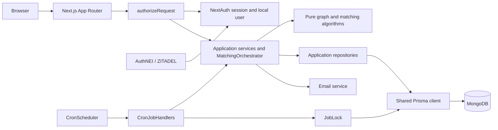

# Architecture

The application separates request handling, matching decisions, and persistence. See [ADR 0001](./decisions/0001-centralize-request-authorization.md) and [ADR 0002](./decisions/0002-extract-pure-matching-core.md) for why the boundaries exist.

Routes validate input and ownership after access checks. The scheduler manages timers; cron handlers and MongoDB-backed locks coordinate background work. The domain core has no database, framework, or email dependency.
