# Domain model

Source: [`prisma/schema.prisma`](../../prisma/schema.prisma). Attributes list stored Prisma fields; relation fields appear as edges. `"optional"` marks nullable Prisma fields. `String[]` and `Json[]` are Prisma list types.

Only declared Prisma `@relation` references are drawn. Other ID fields and partition keys are stored values, not Prisma relations.

```mermaid
erDiagram
    User {
        String id PK
        String name
        String email UK
        String phone "optional"
        Boolean emailVerified
        Boolean emailNotifications
        Boolean sharePhoneOnMatch
        DateTime createdAt
        DateTime onboardingCompletedAt "optional"
        Role role
    }

    UserIdentity {
        String id PK
        String provider
        String providerSubject
        String userId FK,UK
        DateTime createdAt
        DateTime updatedAt
    }

    Subject {
        String id PK
        String code UK
        String name
        Int year
        Int semester
    }

    "Class" {
        String id PK
        String name UK
        Int year
    }

    SingleSwapRequest {
        String id PK
        String userId FK
        String subjectId FK
        String currentClassId FK
        String[] preferredClassIds
        Boolean preferenceOrderMatters
        TicketType ticketType
        RequestStatus status
        Int priority
        Float satisfactionScore "optional"
        String provisionalMatchId "optional"
        DateTime provisionalUntil "optional"
        String graphPartition
        DateTime createdAt
        DateTime updatedAt
        DateTime lastProcessed "optional"
    }

    BundleSwapRequest {
        String id PK
        String userId FK
        String currentClassId FK
        String[] preferredClassIds
        Boolean preferenceOrderMatters
        TicketType ticketType
        RequestStatus status
        Int priority
        Float satisfactionScore "optional"
        String provisionalMatchId "optional"
        DateTime provisionalUntil "optional"
        String graphPartition
        DateTime createdAt
        DateTime updatedAt
        DateTime lastProcessed "optional"
    }

    Match {
        String id PK
        MatchType matchType
        SwapPattern swapPattern
        MatchStatus status
        Boolean isProvisional
        DateTime provisionalUntil "optional"
        Float satisfactionScore "optional"
        Int processingTime "optional"
        String graphPartition
        Json[] participants
        String[] singleSwapRequestIds
        String[] bundleSwapRequestIds
        DateTime createdAt
        DateTime updatedAt
    }

    MatchNotificationDelivery {
        String id PK
        String matchId
        String userId
        String notificationType
        String email
        NotificationDeliveryStatus status
        DateTime reservedAt
        DateTime sentAt "optional"
        String lastError "optional"
        DateTime updatedAt
    }

    GraphPartition {
        String id PK
        String partitionKey UK
        TicketType ticketType
        String subjectId "optional"
        Int year "optional"
        Int activeRequests
        DateTime lastProcessed "optional"
        Int avgProcessingTime "optional"
        Float successRate "optional"
        Int priority
        Boolean isLocked
        DateTime lockedAt "optional"
        String lockedBy "optional"
        DateTime createdAt
        DateTime updatedAt
    }

    CronExecution {
        String id PK
        String jobId
        String jobName
        DateTime startedAt
        DateTime completedAt "optional"
        Int duration "optional"
        CronStatus status
        Int processedPartitions
        Int matchesFound
        Int expiredMatches
        Int totalActiveRequests
        String[] errors
        Json metadata "optional"
    }

    CronLock {
        String id PK
        String jobId UK
        DateTime expiresAt
        DateTime createdAt
    }

    RateLimitBucket {
        String id PK
        String key UK
        Int count
        DateTime expiresAt
        DateTime createdAt
    }

    User ||--o| UserIdentity : "userId -> id"
    User ||--o{ SingleSwapRequest : "userId -> id"
    User ||--o{ BundleSwapRequest : "userId -> id"
    Subject ||--o{ SingleSwapRequest : "subjectId -> id"
    "Class" ||--o{ SingleSwapRequest : "currentClassId -> id"
    "Class" ||--o{ BundleSwapRequest : "currentClassId -> id"
```

Single swaps cover one subject; bundle swaps cover all subjects in a year. Their `graphPartition` keys are `subject-<subjectId>` and `year-<year>`, respectively. `Match.singleSwapRequestIds`, `Match.bundleSwapRequestIds`, and each request's `provisionalMatchId` are logical links without Prisma `@relation` declarations.

Composite unique constraints: `UserIdentity(provider, providerSubject)` identifies an OIDC account, and `MatchNotificationDelivery(matchId, userId, notificationType)` prevents duplicate delivery records.

Enum values: `RequestStatus` = `ACTIVE`, `MATCHED`, `CANCELLED`, `EXPIRED`, `COMPLETED`; `MatchStatus` = `PROPOSED`, `ACCEPTED`, `REJECTED`, `COMPLETED`, `PROVISIONAL`, `UPGRADED`; `SwapPattern` = `DIRECT`, `THREE_WAY`, `MULTI_WAY`; `TicketType` = `SPECIFIC_CLASS`, `ALL_CLASSES`.
